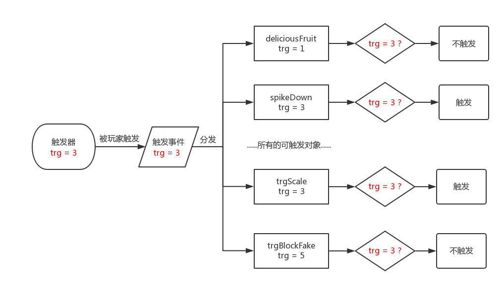
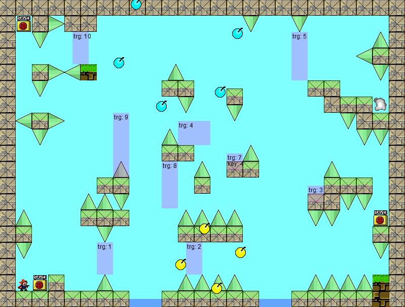

# 新触发系统

触发是 I Wanna 中各种坑实现的基础。果引擎 2.0 版重写了触发系统以提高运行时效率，使用起来几乎与原来一致。[查看使用说明](/trigger?id=trg-与-key-一体化)

## 简介

触发系统主要包含两种 `object`：触发器与触发对象，它们通过 `触发事件` 联系到一起。该系统的运作方式可概括为下图：



- 触发器指一类会响应 `player` 动作的 `object`，它可以在某种条件下发出带有一定标记（`trg`）的 `触发事件`。包括：

  - 隐形的 `trigger`，当 `player` 与之相碰撞时，发出 `触发事件`；
  - 延时的 `trigger`，当 `player` 与之相碰撞之后，过一段时间再发出 `触发事件`；
  - 可见的 `button`，当 `player` 射击击中时，发出 `触发事件`；
  - ...

* 触发对象是一类可以响应 `触发事件` 的 `object`，包括：

  - 在触发后会运动的刺
  - 在触发后会运动的板子
  - 在触发后会被创建的隐形砖
  - 在触发后会做任何动作的任意 `object`

## trg 与 key 一体化

在之前的版本中，`keyTrigger` 经常用于回头坑，因为它在指定 `trg` 的 `freeTrigger` 触发之前不会对 `player` 的任何动作作出反应。而在 2.0 版中，`freeTrigger` 与 `keyTrigger` 合并为了 `objTrigger`。`objTrigger` 的使用方法与 `freeTrigger` 完全一致。并且，当在 `Creation Code` 中指定 `key` 时，即可当做 `keyTrigger` 使用。

普通 objTrigger：

```gml
trg = 1
ys = 6
```

当作 keyTrigger 使用：

```gml
trg = 2
key = 1
ys = 6
```

为了更方便地调试触发机关，在[调试模式](trigger?id=调试模式以及报错)下 `objTrigger` 会有一些额外的处理。

## playerKiller 均可被触发？

这也是果引擎 2.0 版中触发系统最明显的变化。

你可以将 `spikeDown` 直接摆放在房间中，然后在 `Creation Code` 中写入：

```gml
trg = 1
v = 4
```

这样它就成为了一个可以被 `trg = 1` 的 `objTrigger` 触发的触发刺。

也可以使用速度 + 方向：

```gml
trg = 1
spd = 6
dir = 45
```

当然，`path`、`scale`、`rotate` 模式均支持该写法。如果在 `Creation Code` 中将 `move` 设置为 `true`，在 `player` 死亡时触发刺会脱离原来的 path 而改为直线运动，防止对玩家的剧透：

```gml
// 使用 path 模式
trg = 1
pth = pCircle
spd = 5
enda = PATH_ACTION_STOP
// 猜猜我要去哪？
move = true
```

```gml
// 使用 scale 模式
spr = sprSpikeUp
tarx = 2
tary = 2
cx = 16
cy = 32
time = 15
trg = 1
```

```gml
// 使用 rotate 模式
spr = sprSpikeUp
trg = 7
cx = 0
cy = 32
angle = 90
time = 20
```

?> 当 playerKiller 被直接摆放在房间外时，引擎会自动设置 `noDes = true`，确保它能被正确地创建。

## 时序触发器

该 `object` 可以在 `Objects -> triggers -> objSequenceTrigger` 找到。用于触发一些按特定顺序出现的坑。

应用场景举例：

`player` 碰到时直接触发 `trg = 1` 的`触发事件`，1 秒之后触发 `trg = 2`的`触发事件`

```gml
trg[1] = 1
time[1] = 50
trg[2] = 2
```

`player` 碰到时不触发任何事件，1 秒之后触发 `trg = 1` 的触发事件，3 秒之后触发 `trg = 2` 的触发事件：

```gml
trg[1] = 9999
time[1] = 50
trg[2] = 1
time[2] = 100
trg[3] = 2
```

## 调试模式以及报错

当游戏以调试模式运行时，`objTrigger` 会显示当前的 `trg` 以及 `key` 以便观察：



当 `objTrigger` 等 `object` 的 `Creation Code` 中没有 `trg` 时，引擎会捕捉到这类错误并抛出一个错误，如：


此时在对应房间对应位置的对应 `object` 的 `Creation Code` 中补充必要的参数即可。
